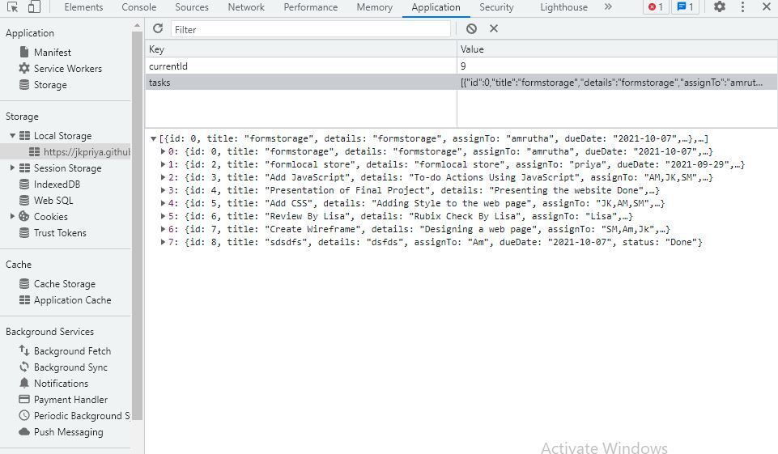
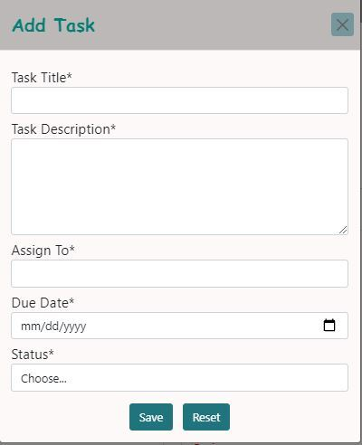

# taskPlanner-FP
Developed By-Amrutha,Priya and Sisile

## Objective
- Create a Task Planner App from Scratch where the user can add,edit and delete the tasks.

> ### WireFrame
>- We took inspiration from the Trello Board and we created our tasks to show according to the present status. 
>- 

## Functionalities
 1. ### Add Task:
    - We got user task details using Task form and added it to the `Tasks[]`array with an unique Task-id.`Task[]`array is stored in a browser local storage.
    
    
    
2. ### Edit Task :
    - User can edit the task details by clicking the `edit` button and the edited details are updated in the `Task[]`array using their `Task-id`.
    - The task card moves to its respective status column as user modified.
    - When the task status is `done` the user can't edit the task.

3. ### Delete Task:
    - The user can delete task at any point using `Delete` button in a task card then it also delete from a `task` array.
4. ### Render():

    - `Render()` function display all the task cards in the screen  from the `Tasks[]` array fter adding ,editing and deleting the task.

## Technologies Used
- GITHUB and GIT
- HTML
- CSS
- BootStrap
- Vanilla Java Script
- Browser Local Storage

## Expected Final Output 

## GitHub Page
[GitHub Page](https://jkpriya.github.io/taskPlanner-FP/)

 

